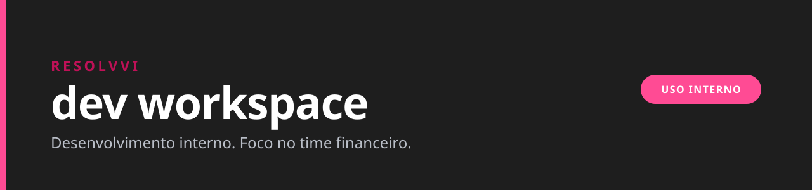

  

  
  
  

## Sobre este perfil

Este é o espaço de desenvolvimento interno da **Resolvvi**. Ele centraliza o código que sustenta a operação do dia a dia, com foco nas rotinas do time financeiro.

A maioria dos repositórios é privada porque carrega informação da empresa. O que estiver público aqui é material que pode circular sem restrição.

## Stack

  
  
  
  
  
  
  
  
  
  

---

Resolvvi · legaltech brasileira · conteúdo deste perfil destinado ao time interno
